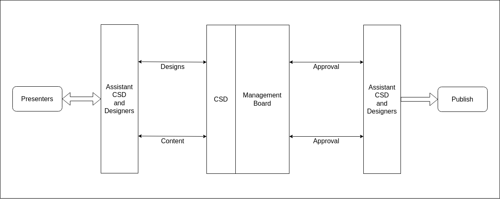

# ⌨ Hands On

> ### If you can't explain it simply, you don't understand it well enough.
>
> \- Albert Einstein

Einstein has already told us the real meaning of understanding. Knowledge is just a group of facts until we understand the topic and its inner workings, and this knowledge can be achieved through various sources. Understanding and gaining knowledge of the topic from ocean of sources and tracing finest parts of i can be difficult and time consuming.&#x20;

So here we bring **Club Service** where we aim gaining knowledge through our peer who has already worked on a topic, teaching us, clearing doubts in a very structured manner. We gather in the classroom learn and understand, discuss and the end test our understanding making us thorough in the topic.

## Workflow

* **Day 1 - Day 3**: Presenters and Assistant Club Service Directors **discuss the topic** and **finalize** it.
* **Day 3 - Day 4**: Submit the collected **title, sub-topics** to Assistant Designers and Assistant Public Relation Officers.
* **Day 4 - Day 7**: **Verify** created **designs** and **promotional message** from Vice-President and Club Service Directors by Assistant Designers and Assistant Public Relation Officers.
* **Day 7 - Day 10**: **Minimum 2 demos** of the Club Service and **publishing** of **promotional message**.
* **Day 11 - Day 14**: **Conduct Club Service**.&#x20;

## Presenter's Guidelines

* [ ] Presenter should **ensure authenticity** of the information from multiple sources.
* [ ] No content of the presentation should be copied from any other source(your understanding should be the source 😊) and should be **plagiarism free**.
* [ ] **First slide** should always be the **poster** created for the Club Service.
* [ ] Name of presenter should link to their **Github profile**.
* [ ] Images should be crystal-clear and of **higher quality** and should **attribute to its origin**.
* [ ] **Density of images** in the presentation should be good and should be distributed. Images here refer to diagrams, flowcharts, etc.
* [ ] Presentation should have **References** and **Further Reading** slide at the end.

## Promotion Guidelines

* [ ] Design of poster should be **approved by President/Vice President**.
* [ ] Club Service should be promoted on **all the social media platforms** where ever club is active.
* [ ] **Presenters should be mentioned** on every post if they have their account on the platform.

_**Guidelines are to be strictly followed and must be safeguarded by Club Service Director.**_
