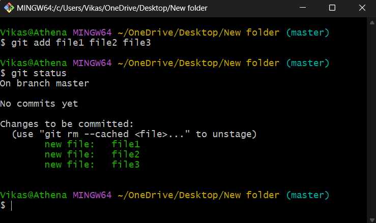

# Knowing Git

## Writers

* [Vikas Gouda](https://github.com/vikas-gouda)
* [Lokesh Patil](https://github.com/lokeshpatil01082002)
* [Siddharth Salunkhe](https://github.com/Sidd-77)

_"Git is a way to manage the chaos that software development inevitably creates."_&#x20;

**- Jim Jagielski**

## Origin of Git

In 2002 Linus Torvalds started using BitKeeper (a proprietary source-control management system by BitMover ) for the development of the Linux kernel. But BitMover started to put restrictions on the development of Linux kernel in return for a non-pay license. Also, access to metadata was not given for kernel-related projects so without metadata developers were unable to compare previous kernel versions. Hence for the development of the Linux kernel Linus Torvalds started to work on the version control system on 3 April 2005 and on 21 December 2005, an open-source version control system Git 1.0 was released.

## Introduction to Git

Git is a free and open-source distributed version control system used to manage projects with speed and efficiency. Unlike other version control systems git stores snapshots instead of storing the entire file, Snapshot is like a photograph or a log that describes how the project was at a particular time or version. It also logs all the changes made in the project and by which contributor which makes it secure.

* Open Source and Free&#x20;
* Fast and Secure&#x20;
* Cross-Platform Support&#x20;
* Distributed System&#x20;
* Works without internet&#x20;
* Light and Reliable

## Architecture of Git

Unlike other version control systems Git uses three stage architecture. The three stages are Working directory, Staging area and Git repository. First lets understand some basic terms related to git architecture :&#x20;

● GIT Repository : A GIT repository is a .git directory inside a project which tracks all changes made to files in your project by writing history over time.&#x20;

● Local Repository : Local repository is a git repository that is stored on your computer. Commits are made and updates are taken from the local repository.&#x20;

● Remote Repository : Remote repository is a git repository that is stored on server. Changes are pushed and pulled from local repositories to the remote repositories.&#x20;

● Working Directory : Working directory is basically the project folder or workspace.&#x20;

● Staging Area : Staging area/index is like a buffer between working directory and repository. It consists of changes made which are going to be committed.

## Workflow of Git

Git has three main stages which are modified, staged and committed. We will look at them one by one :&#x20;

●Modified : In this stage files are modified in your working directory but is not committed yet.&#x20;

● Staged : In this stage modified files are marked for commit and are in staging area/index.

● Committed : In this stage modified files are committed and and snapshot is saved in git directory.

<figure><figcaption></figcaption></figure>

One can directly commit the modified file but it is a good practice to stage it first. There are some other operation in git which are used while working on a Remote repository such push and pull. Pull operation copies the changes from remote repository to local repository while push operation copies changes from local repository to remote repository.

<figure><figcaption></figcaption></figure>

## How to install GIT?

#### For Windows:&#x20;

If you are a windows user just go to the git website and download GIT for windows.                         Link:[ Git - Downloading Package (git-scm.com)](https://git-scm.com/download/win)

#### &#x20;For Linux/Unix:&#x20;

Link: [Git (git-scm.com)](https://git-scm.com/download/linux)

Just run the commands for your Linux and you are good to go with the GIT.&#x20;

Now let’s set up GIT on our Computer….

### Configuring GIT

`git config --global user.name "your_name"`&#x20;

`git config --global user.email "your_eamil@email.com"`

``

Now we have successfully installed GIT on our computer, So to configure our username and email we have to run the above two commands. Now you have a question... _**“Why should I give my username and email to GIT?”**_, the answer is simple, when you make commits the name and the email through which a developer made a commit gets recorded so that a complete track of changes can be logged.

### Initialising GIT Repository

`git init`

It initializes a .git repository, a hidden repository as it begins with ‘.’. It stores all the head pointers of the branches and logs of the commits. It converts a Repository into a Repository which gets tracked by the GIT.

### Status of Repository

`git status`

Shows the state of the working directory and staging index. It shows which files are added and which files are deleted, it also shows which files are modified and show the state of the files.

<figure><figcaption></figcaption></figure>

### Adding files to Staging Index

`git add <file_name>`

Adds the files in the Staging Index. It adds all the changes into the staging index, changes can be the creation of a file or deletion of files and it also adds the modification of the files.

<figure><figcaption></figcaption></figure>

### Commit the changes

`git commit -m "your_message"`

Saves the changes that are staged using the git add. It saves the changes that were added in the staging index and saves the changes with a commit ID which we get by using the git log.

<figure><figcaption></figcaption></figure>

### Logs of the Commits

`git log`

Shows the records of the commits. It shows all the history of the commits and also shows who made the commits and when the commits are made. The Highlighted part of the commit is the commit code by using which, we can revert back to that version of the file.

<figure><figcaption></figcaption></figure>

### Connect with Remote

`Git remote add origin <link>`

Create, view, and delete connections to other repositories. It makes a path between your local repository and the remote repository, through which we can push and pull all the changes.

`git remote -v`

By using the git remote -v command you can see all the remote links.

<figure><figcaption></figcaption></figure>

### Pushing to remote

`git push origin master`

Upload local repository content to a remote repository. It pushes all the files present in our local repository to the remote repository.

<figure><figcaption></figcaption></figure>

### Pulling from remote

`git pull origin master`

Fetch and download content from a remote repository.&#x20;

To show how git pull works I delete a file in the remote repository which contains all three files which are pushed before. As you can see after pulling the changes from the remote repository the number of files which was three before the pulling now changes to only two files i.e file1 and file2 only.

<figure><figcaption></figcaption></figure>

## Some Advanced Git Commands:

### git rebase

Rebase is developed to integrate changes made from one branch of a repository onto another one.

&#x20;The procedure of making a combination or movement within commit sequences placed on top of another new base commit is said to be re-basing.&#x20;

Re-basing broadly depicts the merging process with linearity.&#x20;

**Command Syntax:**&#x20;

`$ git rebase`

``

### git bisect

When the situation occurs as a commit has created a bug in the repository code, in such a scenario git bisect command is useful for searching for that commit.

With help of git bisect we can keep track of where the code was working exactly fine and where it disturbed.

Moreover git bisect is useful to search for bad commits within a repository.

**Command Syntax:**&#x20;

_i) For starting the git bisect_

&#x20;`$ git bisect start`

_ii) To know about a good commit_

&#x20;`$ git bisect good a123`

&#x20;_iii) To about a bad commit_&#x20;

`$ git bisect bad z123`

``

### git cherry-pick

Git cherry-pick is the powerful and robust command by means of which user can pick any commit from any branch of repository and to apply it on any other branch within same repository.

Git cherry-pick can enables arbitrary previous git commits which is to be selected by reference and append to the current working branch

Precisely, Cherry picking is the process of picking a commit within an branch and to apply it to other branch.

**Command Syntax:**

&#x20;`$ git cherry-pick`

### git archive

To create an archive file by Git references such as commits, other branches, the git archive is used.

User can pass additional arguments to the git archive command which will be accepted and applied on the archive output.

**Command Syntax :**&#x20;

`$ git archive --format zip HEAD > archive-HEAD.zip`

### git pull --rebase

Within working on git repository , many of the times there is need to do rebase while using git pull ,In such scenarios user can perform the option of git pull rebase.

It helps by avoiding multiple merges.

**Command Syntax:**&#x20;

`$ git pull --rebase`

### git blame

If there is any need to check and test the content of any file line by line approach , we use git blame.

git blame is useful to get to know who have made the changes to the particular file in repository.

**Command Syntax:**

&#x20;`$ git blame <your_file_name>`

### git tag

git tags are basically used to manage the releases. git tag broadly means pointing out the branch that will not change.

Git tags are very useful while working with the public rebase.

**Command Syntax:**&#x20;

`$ git tag -a v1.0.0`

### git citool

Git citool is the graphical interface to review modified files , and stage such files into the index or entering a commit message , adding a new commit for the current working branch.

In other words git citool works as a graphics alternative of the git commit.

**Command Syntax:**&#x20;

`$ git citool`

### git mv

When there is a need to rename a git file, it will accept two arguments as , source and target file name the git mv command is useful.

**Command Syntax :**

`$ git mv <old-file-name> <new-file-name>`

### git clean

Git clean is used to clean the repository as it removes files which are not under any version control.

Usually, the files which are not unknown to git are removed initially.

If any optional \<path>  is specified as arguments then only those paths are affected.

**Command Syntax:**&#x20;

`$ git clean`

``

So, if you're interested in improving your skills as a developer, I encourage you to dive deeper into GIT and all it has to offer. With the right knowledge and tools at your disposal, you can become a more efficient and effective developer, and take your projects to the next level.

And if you're already a seasoned Git user, remember to share your knowledge and expertise with others. By doing so, you'll not only help others succeed, but you'll also contribute to the larger community of developers and coders who are using Git to build the future.

In conclusion, Git is a powerful tool for managing code and collaborating with others. Whether you're just starting out or have been using Git for years, there's always more to learn and explore. So keep digging deeper, and keep pushing the boundaries of what's possible with Git!

For more information about our club you can visit us on:

* [Website](https://www.wcewlug.org/)
* [Facebook](https://www.facebook.com/wlugclub/)
* [Twitter](https://twitter.com/wcewlug)
* [LinkedIn](https://www.linkedin.com/in/wlug-club-3a9236117/)
* [Instagram](https://www.instagram.com/wcewlug/?hl=en)
