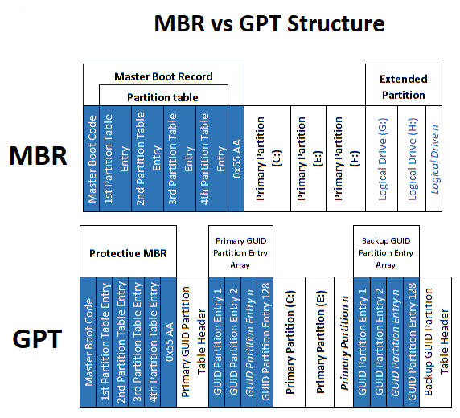

# Memory and Storage Management in Linux

### Writers:

* [Gopal Shendge](https://github.com/gopalshendge18)
* [Prajwal Shah](https://github.com/pajju0330)

_"The memory management on the PowerPC can be used to frighten small children._ **"**

**-Linus Torvalds**

## Introduction to Memory

Before going deep down into the Linux memory and storage management, let’s first understand the term what is memory. We have been listening to memorised words from our school time. Memory comes from the Latin word _memory_ which means simply remembering things. As we know computer tasks are to deal with data or with help of data giving the results which are requested by users. To get this done there should be some facility to store the data. Based on the requirement the architect of the computers divide memory into two parts primary and secondary.

As the name suggests primary memory is in which the computer operates and secondary memory is like storing the data or programs /set of instructions that may not need a computer /user currently but it might need in the future. Besides any operating system, the memory gets divided into primary and secondary. You can assume a shop as primary memory and a godown as secondary memory. Primary memory is RAM and ROM which can be directly accessed by the CPU.

When a question arises to store the data for the long run then secondary storage comes into the picture.USB, optical drives, and magnetic tape are some of them.


Here MMU stands for memory management unit and is a hardware component that manages virtual address mapping.


Let's understand one by one.

## Physical Memory

It is also known as random access memory. Physical memory can be said as actual memory present in the machine. It is a kind of volatile hardware main memory installed on DRAM(Dynamic Random Access Memory). It is very fast while accessing as compared to non-volatile disk storage. Due to faster accessibility, it is costlier. This memory is responsible for loading and running all the software, and applications. Here memory is divided into addresses, which tells the operating system the exact location of data/set of instructions in the disc while loading and running the application. It exists on chips and storage devices like a hard disk. In an operating system, every task is considered one process. Before executing the process it is loaded into RAM physical memory. To know the physical memory in Linux you just have to type the `free -h` command in terminal.

In the below table, you can see the meaning of each part in memory usage:

Here you can see that my machine RAM is 7.7 GB of which 3.4 GB is currently used by all applications and 1.4 GB RAM is not acquired by any software applications. Also, there is a swap of size 23 GB which is used by the operating system in case all RAM is acquired by other applications so that it can be swapped to that space.

## Virtual Memory

Virtual memory makes a system that has more memory than it has[\[1\]](https://pt.slideshare.net/adisesha12/operating-system-116114239). As we discussed earlier physical memory due to its fast accessibility and it is the main memory where all applications run and load is too expensive. Due to this, every software engineer comes up with an idea called virtual memory. A system that implements virtual memory provides an illusion to the applications that it has more memory space than actual physical memory. In most cases, the operating system's data is interchanged between ram and rom with the help of virtual memory. To understand this we need to understand what paging, segmentation, and swapping are.

In Linux, every task/process is divided into pages. A process is nothing but a set of instructions for an application/software. There are two ways two divide the physical memory which is generally used by today's operating system. The paging and segmentation. In paging, the physical memory that is ram is divided into pages where each process is stored. Here the size of each page is the same no matter how long a set of instructions/processes. So sometimes what happens is that whenever applications load in the pages due to the same size instructions will not stick to one page. So basically paging is done according to the size of instruction whereas in segmentation the physical memory gets divided into segments of variable size according to each process. Although it is efficient to divide into segments in which there is no need for swapping as required in the case of paging. More surprisingly Linux uses paging commonly due to Memory management being simpler when all processes use the same segment register values than when they share the same set of linear addresses. The secondary memory, also called non-volatile memory, is divided into blocks. Whenever some application acquires all pages in physical memory then virtual provides pages by unused swapping pages in physical memory. The virtual memory allows it to run larger programs and enables those programs to run. Here the Linux kernel writes all the content of unused blocks of memory to the hard disk so that the memory can be used for another purpose. Linux programs are always looking for larger memory space rather than space residing on the disk from time to time. You should also know that Linux allows one to use several swap partitions and/or swap files at the same time. This means that if you only occasionally need an unusual amount of swap space, you can set up an extra swap file at such times, instead of keeping the whole amount allocated all the time.

&#x20;To access all the pages while loading and running the applications operating system can't search for the whole disk which in the end downgrades the performance. So Linux maintains a virtual address in the table. The Physical addressing mode requires no page tables and the processor does not try to perform any address translations in this mode. The Linux kernel is linked to run in physical address space. To know the virtual memory size you can use the command `grep VmallocTotal /proc/meminfo` which will give the total size of virtual memory.

## Linux Page Tables

Linux divides the pages into three levels of page tables. Each Page Table accessed contains the page frame number of the [\[1\]](https://pt.slideshare.net/adisesha12/operating-system-116114239) next level of the Page Table. Fig shows how a virtual address can be broken into several fields; each field providing an offset into a particular Page Table. To translate a virtual address into a physical one, the processor must take the contents of each level field, convert it into an offset into the physical page containing the Page Table and read the page frame number of the next level of the Page Table. This is repeated three times until the page frame number of the physical page containing the virtual address is found. Now the final field in the virtual address, the byte offset, is used to find the data inside the page. Although x86 processors have two levels of the page table.

## Partitions of the Disc in Linux

Whenever we are dealing with files to keep it as records or share them with someone we create files. To create a file there is the facility of file system and swap resources which is provided by Linux logical volume manager(LVM) Along with this it can provide RAID storage system features like mirroring, striping, and concatenating. Let's understand the partitions in Linux. There are three total types of partitions logical, physical and extended. The partitions term is related to hard disc. It is very feasible when we partitioned the disc according to our specific requirements. For hard discs irrespective of the disc we can allow you to only make up to four partitions but when u want more partitions then we can divide one of the partitions into sub-partitions. These partitions are inside the primary partition only. The extended partitions are those other than primary partitions. When we create logical partitions all these come under extended partitions. In the below image you can see those partitions that I have made.

Using the command `parted -l` you can see all the partitions. In the serial, there are two primary partitions for windows as windows uses the NTFS file system because here My machine is dual-booted. If you haven't attended the session organised by WLUG then please do check our website for the Linux file system [\[3\]](https://docplayer.net/). Then at number 3, you can see a total of 738 GB of partitions is of type extended. All the logical partitions are done in this partition. The partition of 75 GB is for Ubuntu which uses a file system of ext4. At number 8 it has partition file type Linux swap. This space is used to extend the amount of effective RAM on a system, as virtual memory for currently running programs. But you can't just buy extra RAM and eliminate swap space. Linux moves infrequently used programs and data to swap space even if you have gigabytes of RAM.

In Linux, there is no c drive/d drive like it is in windows. You can see name like dev /sda1 dev/sda2 etc. Here dev means device The term sd stands for SCSI disk, that is to say, it means Small Computer System Interface disk. So, sda1 means the first SCSI hard disk. Linux / stands for root directory which is the only directory that has administration files when there is only a single user mode boot. /dev is all the files under the root directory. In the below image you can see the files under /dev.

## What are MBR and GPT?

Master Boot Record(MBR) and GUID Partition Table(GPT) are ways used for storing the partitioning information on a drive. The beginning and end of the partition on the physical disk are included in this information, so your operating system knows which sectors belong to each partition and which partition is bootable.[\[4\]](https://www.howtogeek.com/193669/whats-the-difference-between-gpt-and-mbr-when-partitioning-a-drive/) This is why you have to choose MBR or GPT before creating partitions on a drive.

First introduced in 1983, MBR stands for Master Boot Record as MBR is a special boot sector located at the very beginning of a drive. A boot loader is contained in this sector for the installed operating system and information about the drive’s logical partitions. The small bit of code that generally loads the larger bootloader from another partition on a drive is called a bootloader. In windows, you may have to repair your MBR if it’s overwritten and Windows won’t start. If you have Linux installed, the GRUB boot loader will typically be located in the MBR

Limitations of MBR are like, MBR also only supports up to four primary partitions—if you want more, you have to make one of your primary partitions an “extended partition” and create logical partitions inside it. MBR only works with disks up to 2 TB in size. GPT is gradually replacing MBR. It replaces the old BIOS with something modern, it replaces the clunky old MBR partitioning system with something more modern. It’s called the GUID Partition Table because every partition on your drive has a “globally unique identifier,” or GUID—a random string so long that every GPT partition on earth likely has its unique identifier.

GPT does not have the same limitations as MBR. GPT-based drives can be much larger, with size limits dependent on the operating system and its file systems. GPT also allows for a nearly unlimited number of partitions. Again, the limit here will be your operating system—Windows allows up to 128 partitions on a GPT drive, and you don’t have to create an extended partition to make them work.

## How Linux manages Storage Devices

Master Boot Record(MBR) and GUID Partition Table(GPT) are ways used for storing the partitioning information on a drive. The beginning and end of the partition on the physical disk are included in this information, so your operating system knows which sectors belong to each partition and which partition is bootable.[\[4\]](https://www.howtogeek.com/193669/whats-the-difference-between-gpt-and-mbr-when-partitioning-a-drive/) This is why you have to choose MBR or GPT before creating partitions on a drive.

First introduced in 1983, MBR stands for Master Boot Record as MBR is a special boot sector located at the very beginning of a drive. A boot loader is contained in this sector for the installed operating system and information about the drive’s logical partitions. The small bit of code that generally loads the larger bootloader from another partition on a drive is called a bootloader. In windows, you may have to repair your MBR if it’s overwritten and Windows won’t start. If you have Linux installed, the GRUB boot loader will typically be located in the MBR

Limitations of MBR are like, MBR also only supports up to four primary partitions—if you want more, you have to make one of your primary partitions an “extended partition” and create logical partitions inside it. MBR only works with disks up to 2 TB in size. GPT is gradually replacing MBR. It replaces the old BIOS with something modern, it replaces the clunky old MBR partitioning system with something more modern. It’s called the GUID Partition Table because every partition on your drive has a “globally unique identifier,” or GUID—a random string so long that every GPT partition on earth likely has its unique identifier.

GPT does not have the same limitations as MBR. GPT-based drives can be much larger, with size limits dependent on the operating system and its file systems. GPT also allows for a nearly unlimited number of partitions. Again, the limit here will be your operating system—Windows allows up to 128 partitions on a GPT drive, and you don’t have to create an extended partition to make them work.

Just like it is difficult to understand the difference between these phrases:

A child can be frightened by the PowerPC's memory management. Young children may be scared by PowerPC's memory management. In the PowerPC, there is a memory management scheme that can cause small children to get scared. Small children can be scared by the PowerPC's memory management. PowerPC memory management can scare small children.

The same is the complexity of memory management in Power PC !

Reference
--------------------------------------------------------------------------------------

1. [https://pt.slideshare.net/adisesha12/operating-system-116114239
   ](https://pt.slideshare.net/adisesha12/operating-system-116114239)
2. [https://frameboxxindore.com/linux/you-asked-what-is-sda-and-hda-in-linux.html
   ](https://frameboxxindore.com/linux/you-asked-what-is-sda-and-hda-in-linux.html)
3. [https://docplayer.net/](https://docplayer.net/)
4. [https://www.howtogeek.com/193669/whats-the-difference-between-gpt-and-mbr-when-partitioning-a-drive/](https://www.howtogeek.com/193669/whats-the-difference-between-gpt-and-mbr-when-partitioning-a-drive/)

For more information about our club you can visit us on:

* [Website](https://www.wcewlug.org/)
* [Facebook](https://www.facebook.com/wlugclub/)
* [Twitter](https://twitter.com/wcewlug)
* [LinkedIn](https://www.linkedin.com/in/wlug-club-3a9236117/)
* [Instagram](https://www.instagram.com/wcewlug/?hl=en)

